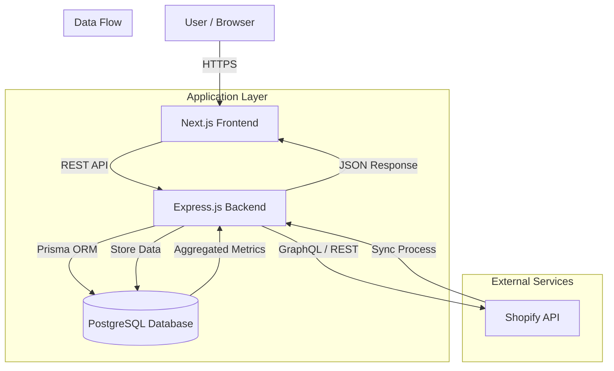

# Technical Documentation

## 1. Assumptions
In developing this solution, the following key assumptions were made:

*   **Shopify Access**: The application assumes it has been granted the necessary Shopify Admin API scopes (`read_products`, `read_orders`, `read_customers`) to fetch required data.
*   **Data Synchronization**: While webhooks are supported in the infrastructure, the primary data ingestion strategy for the MVP relies on on-demand synchronization triggered via the dashboard.
*   **Privacy & Compliance**: Customer names and personally identifiable information (PII) are intentionally excluded from the dashboard UI to prioritize privacy, although they are stored in the database for potential future use (e.g., marketing campaigns).
*   **Single Tenant Focus**: The current dashboard view is designed to analyze one Shopify store (tenant) at a time, selected by the user.
*   **Currency**: All monetary values are assumed to be in the store's default currency (e.g., USD), and multi-currency conversion is out of scope for this MVP.

## 2. High-Level Architecture

The system follows a modern 3-tier architecture:

### Components:
*   **Frontend**: Built with Next.js (React) and Tailwind CSS. It handles user authentication, dashboard visualization (Recharts), and triggers data syncs.
*   **Backend**: A Node.js/Express server acting as the central controller. It manages authentication, API endpoints, and the business logic for data ingestion and metric calculation.
*   **Database**: PostgreSQL, managed via Prisma ORM. It stores tenant configurations, synced Shopify data (Customers, Orders, Line Items), and user credentials.
*   **Shopify Integration**: A hybrid approach using both Shopify's GraphQL API (for efficiency) and REST API (for fallbacks/specific resources) to ingest data.

## 3. APIs and Data Models

### Key API Endpoints

| Method | Endpoint | Description |
| :--- | :--- | :--- |
| **Auth** | `/api/auth/register` | Register a new user. |
| | `/api/auth/login` | Authenticate user and return session token. |
| **Tenants** | `/api/tenants` | List all Shopify stores connected to the user. |
| | `/api/tenants/onboard` | Connect a new Shopify store. |
| **Ingest** | `/api/ingest/sync` | Trigger a full data sync for a specific tenant. |
| **Metrics** | `/api/metrics` | Get aggregated stats (Total Customers, Orders, Revenue). |
| | `/api/metrics/top-products` | Get list of top-selling products sorted by order frequency. |
| | `/api/metrics/orders` | Get time-series data for orders chart. |

### Data Models (Prisma Schema)

*   **User**: Represents an application user.
    *   `id`, `email`, `password`, `name`
*   **Tenant**: Represents a connected Shopify store.
    *   `id`, `name`, `shopifyDomain`, `accessToken`
*   **Customer**: A customer from a Shopify store.
    *   `id`, `shopifyId`, `email`, `firstName`, `lastName`, `totalSpent`, `ordersCount`
*   **Order**: A transactional record.
    *   `id`, `shopifyId`, `orderNumber`, `totalPrice`, `currency`, `financialStatus`, `createdAt`
*   **OrderLineItem**: Individual products within an order.
    *   `id`, `shopifyId`, `title`, `quantity`, `price`

## 4. Next Steps to Productionize

To move this solution from MVP to a robust production system, the following steps are recommended:

1.  **Real-Time Webhooks**: Fully implement and verify Shopify webhooks (`orders/create`, `customers/update`) to ensure data is always up-to-date without manual syncs.
2.  **Background Job Processing**: Offload heavy data synchronization tasks to a background queue (e.g., using BullMQ and Redis) to prevent request timeouts and improve scalability for large stores.
3.  **Caching Layer**: Implement Redis caching for expensive metric calculations (e.g., "Top Products" or "Total Revenue" over large datasets) to reduce database load and improve dashboard response times.
4.  **Rate Limiting & Security**: Add rate limiting to API endpoints to prevent abuse. Ensure strict Content Security Policy (CSP) headers are in place.
5.  **Comprehensive Testing**: Expand test coverage to include End-to-End (E2E) tests (e.g., using Cypress or Playwright) covering the full "Connect Store -> Sync -> View Dashboard" flow.
6.  **CI/CD Pipeline**: Enhance the GitHub Actions workflow to include automated deployment to a staging environment upon successful tests.
7.  **Error Monitoring**: Integrate a service like Sentry or Datadog to track runtime errors and performance bottlenecks in production.
